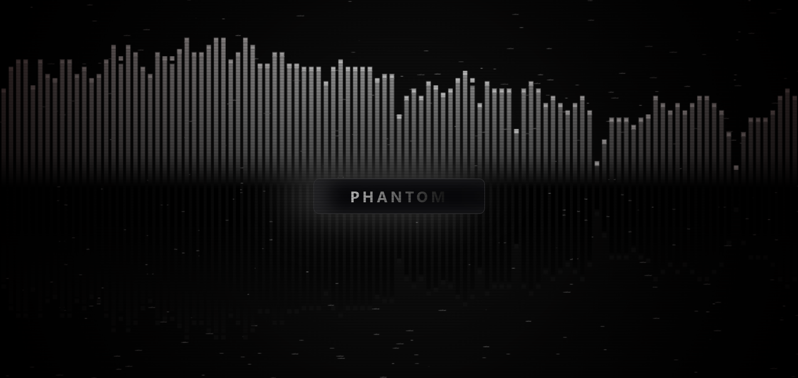

# Arcane Themed Visualizer

## Inspiration 
I literally just finished watching arcane so i had to do something that distracts me from ma meilleure ennemie. Turns out it was impossible (Ball Knowledge Required). So i Made this.

## What is It
It is an audio visualizer that uses Web Audio API and CanvasIt works getting the audio by screen share and then cuts out the video and uses the audio only. 

Because I wanted it to be versitile to my newer music addictions, I built 3 modes

* **Arcane Themed:** It has charecter parrallels 
* **Ambient Mode:** It is Smooth visuals perfect for synthwave
* **Horror Mode:** It has its custom spooky looking feel and it has different aspects added to it 

## How To use
- Clone the repo or download zip and extract 
- Open `index.html` in your web browser
- Click Start and choose the window that is playing audio. if you want to share the entire screen but make sure that share audio button is ticked. 

## Tech Stack
* HTML / CSS / JavaScript
* HTML 5 Canvas
* Web Audio API
## Original Idea
The idea is to project this to my wall to make a smart room. using extend option on any mini projector i will have it on my wall or roof.

## License
This project is licensed under the [MIT license](LICENSE). 
